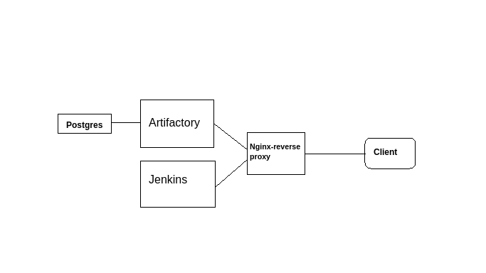

## Description

This project `artifactory-jenkins` allows you to deploy through docker compose both `Artifactory` and `Jenkins` behind an `Nginx` reverse proxy.



## Prerequisites

- `openssl` to create the certificates for both Artifactory and Jenkins.
- `docker compose` to run the application.

**The instructions below are for the Ubuntu distribution. If you are using a different distribution or Operating System the instructions to create the SSL certificates or change the hosts file may change**

## system.yaml file

The `system.yaml` file contains the configurtion for Artifactory conection with the Postgres instance.

The file have to be copied inside `/docker-projects/artifactory-jenkins/volumes/var/etc`.

## Create the SSL certificates

Create your own certificates for Artifactory and Jenkins:

```shell
sudo openssl req -x509 -nodes -days 365 -newkey rsa:2048 -keyout  mydomain-artifactory.key -out mydomain-artifactory.crt

sudo openssl req -x509 -nodes -days 365 -newkey rsa:2048 -keyout mydomain-jenkins.key -out mydomain-jenkins.crt
```

Replace both Artifactory and Jenkins certificates inside your `artifactory-jenkins/ssl` folder with the ones created previously. 


## Build your Nginx image locally

Build your `Nginx` image locally using the Dockerfile locate in `artifactory-jenkins/Dockerfile`.

If the certificates for both Artifactory and Jenkins were created in the previous step (and were placed inside the `artifactory-jenkins/ssl`) you must build a new Nginx docker image based on the Dockerfile to copy those certificates inside the container.

```shell
docker build -t ortfrnc/nginx-artijens:0.0.1
```

If you want to use a different name for the Nginx docker image you must change the variable `NGINX_VERSION` inside the `artifactory-jenkins/.env` file.

## Change your /etc/hosts file

As we are running the docker compose locally with no real domains you must change your `/etc/hosts` file in your system.

Add the subdomains in the line below:

```shell
cat /etc/hosts

127.0.0.1 localhost mydomain.artifactory.com mydomain.jenkins.com
.
.
.
```

## Run the applications

Run the applications with docker compose:

```shell
docker compose up -d
```

To stop the application just run:

```shell
docker compose down
```

## Access the applications in your browser


- Artifactory UI:

```shell
https://mydomain.artifactory.com
```

- Jenkins UI:

```shell
https://mydomain.jenkins.com
```

## Troubleshooting

After running the application you must give it some time to start.

However, if after a reasonable amount of time you can't access the UIs check the Artifactory and Jenkins container logs first:

```shell
docker logs artifactory
docker logs jenkins
```

If you see any permisions issue check the permissions of the `artifactory-jenkins` folder and subfolders and give it proper permissions. Then, restart the application. 

Feel free to leave any comments or questions via an issue!


